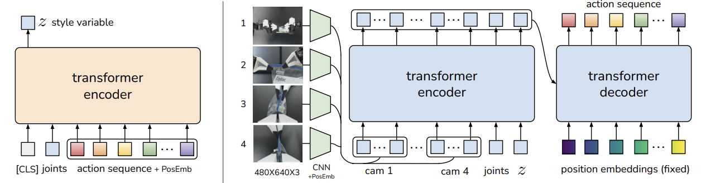
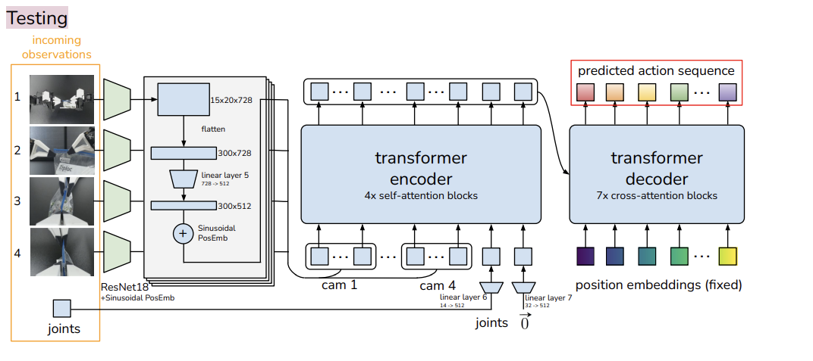
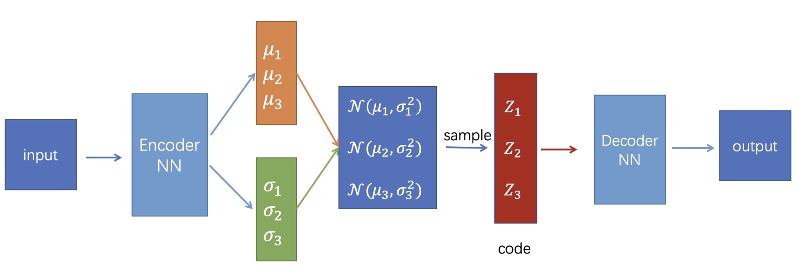
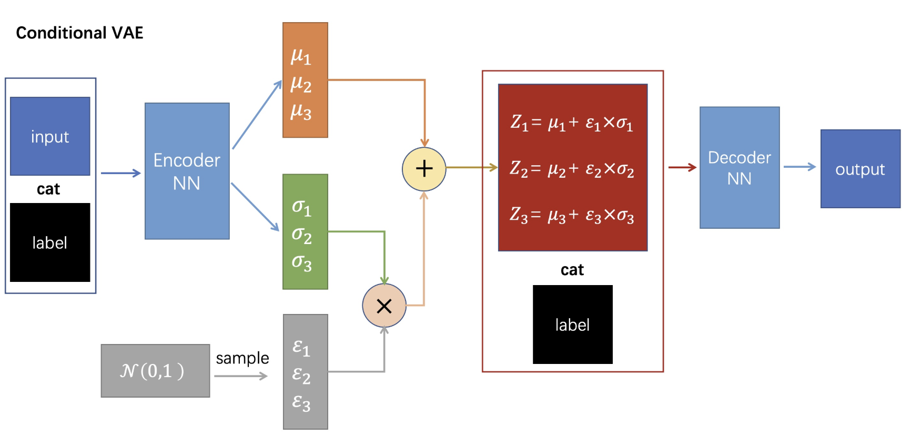
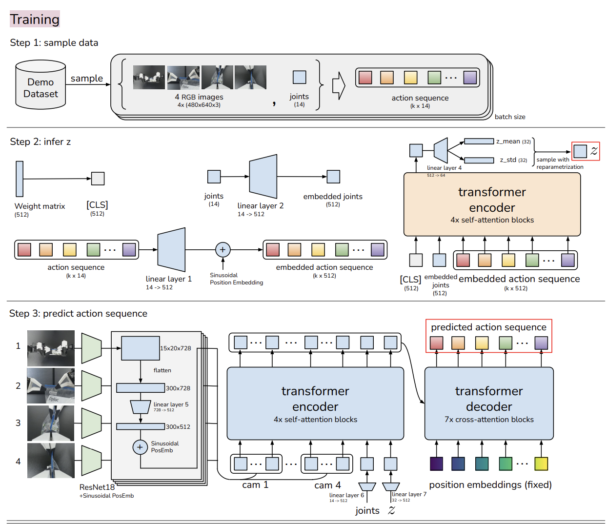
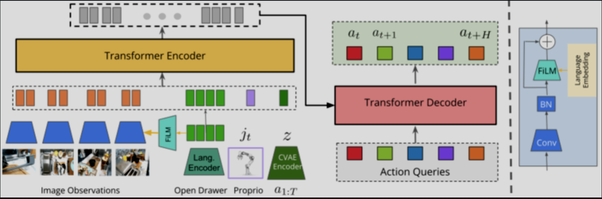

**Manipulation中的"Abandon"级别的technique**

对于大部分入门gripper
manipulation的researcher来说，ALOHA是可以被称为Abandon级别的工作，它不仅标志了一种非常intuitive和efficient的遥操作方式，同时提出的ACT也成为了具身操作算法的classical
baseline，并且因为其简单可用和可插拔的模型结构，应运而生大量的基于其产生的工作，或是增加了别的模态进行融合来优化策略，或是从编码器和解码器角度进行修缮得到更好的性能。

  
  
ACT流程图

这其中非常核心的点就是CVAE，博主在最早期了解这篇文章时只是非常简单的略过了这个方法，但是慢慢地发现这是一个不得不仔细去了解的技术，首先其基于的VAE是变分学习在生成式模型中的典型应用，属于CV中不得不了解的baseline算法，其次它也是有条件生成的工作中非常经典的算法。

  
  
ACT Rollout

**Know-what about CVAE**

从我的视角，一言以蔽之，CVAE是基于原先的VAE模型这种encoder/decoder的架构上，在编解码器上增加了一个标签来引导生成的结果，通过这种方式可以将原先的随机采样生成的方式稳定成一种可以基于条件控制生成的方式，比如对于原先的VAE，我们或许需要一个codebook，对着这个codebook去采样特定的位置以得到对应的生成结果，但是如果我现在显式的用一个label作为条件输入进来，就可以免去"人工查表"的过程来得到可靠预期的生成结果。这个过程当中可以理解为模型学会了一个每一个标签独有的分布，因此可以在有这个标签的条件下生成对应分布下的结果。

也就是说，现在的模型的采样规则里面包含了label信息和重参数化的z信息，整合后的信息被作为decoder的输入，得到期望的结果。

对于Basic的CVAE架构，label一般是one-hot编码，这可以参照CVAE在MNIST数据集上的基于条件生成的算法，但是对于后续越来越多的工作和越来越复杂的任务，编解码器的结构也从原先的简单的MLP和CNN变为了ResNet、Transformer以及Diffusion等模型来适配更加复杂的条件，就比如ACT采用Transformer
Blocks作为Enc/Dec就是考虑到了时序/空间有序以及Token-based输入的问题。但从中也能看到CVAE模型的即插即用能力之强。

  
  
标准VAE架构

  
  
条件VAE架构

在VAE/CVAE中有很多值得去思索的技巧，比如重参数化，它让本来基于采样的不可梯度回传的部分，变成了一个参数化（也就是有一个明确的数学表达式）的过程，通过这种方式，梯度回传也就有迹可循，这也确保了Enc/Dec在训练过程当中的连续一致性。又比如损失函数的设计，从形式上拆分成了重建损失和正则化损失，但是从推导上它又很巧妙地变成了一个最大似然估计的目标函数。

**ACT中的CVAE设计**

对于生成式模型，在训练时和推理时整体的模型结构会有所改变，比如GAN在训练时会有discriminator而在推理时往往不需要判别器只需要生成器，而VAE在训练时会使用encoder/decoder结构，在推理时只需要decoder。

  
  
ACT训练流程

在ACT的训练pipeline中，首先将encoder和decoder一起训练，在这里encoder和decoder都选择了transformer，合理性就在于输入输出都具备一定的时序性，而transformer内禀这种处理时序性问题的推理和生成能力。

Loss的公式看似复杂，但是实际上还是比较好理解的。

从推导的角度，可以通过一些trick从以最大化似然函数的目标函数中得到。

从形式上，设计KL散度作为encoder的正则化项，约束encoder输出的style
variable
z是一个服从高维标准正态分布的值，（至于为什么要这么做，是因为在之后的inference步骤需要将z默认为宇宙万物之源------标准正态分布，在这里的训练中就尽量做对齐或许可以看作是一种"省力"的选择，实际上，这个z可以是任何的分布，但是标准正态分布简单、易于采样而且效果也不错，何乐而不为呢）；设计重建损失来对齐输入和输出也是一个生成式模型的常规思路，只是相比于pixel-based
generative model会使用的L2 reconstruction loss，这里会使用L1
Loss进行监督，实验证明也是效果更优，从主观理解上，或许也是因为输出的是一个动作向量序列，或许存在着潜在的维度匹配的概念（有待查证）；针对这Manipulation，额外设计了一个以优化策略为目标的监督信号也是非常自然的想法。

另外我们需要关注的是ACT在设计输入的过程中的一些巧思，比如从BERT中获得灵感，在encoder中额外输入一个\[CLS\]序列，文中提到是用这个可学习的token来预测z的分布，或许这一块还需要进一步dig
in。（说明要开一个BERT相关的Blog了），又比如在将joint和action
sequence作为输入时加上位置编码来确保时间有序性，在camera
obs输入时增加位置编码来确保空间有序性。

动作分块更是一个相当绝妙的想法，其实这个思路很自然，因为从认知学角度，在人思考一些行为的时候，往往也不是每次只产生一个动作的，也是会在一个思考周期中产生对未来的一连串动作的预判，并且在后续的周期中不断的refine之前预测的内容。这也成为了后续的具身操作生成式模型的典型范式。

**在ACT之后，具身中的CVAE和Action Chunk如何发展？**

在ICRA2024中中稿的RoboAgent，进一步基于CVAE框架，将语言指令融合到其中，提出了MT-CVAE的多任务框架，并且相比于传统的VAE的生成方法，增加了自回归的思路，让生成更加稳定，所以随着算法的发展，必然是通过不同的算法耦合其优势推出更加复杂同样性能也更好的算法体系。

  
  
RoboAgent Framework

最近博主在研究视触觉，一位偶然在其他老师的Lab认识的朋友，最近也release了FreeTacMan这种视触觉采集方式，其中也用ACT
fusion
visuo-actile的方式成功rollout了一些contact-rich的任务。这也证明ACT在一些模态融合的新任务当中，依然是值得信赖的即插即用模块和baseline。也欢迎大家关注这篇文章！

当然，从π0的出现和以CogACT等VLA模型展露出更强大的性能而大行其道之时，当下再去讨论CVAE似乎有点没有意义，但是，仅仅用80M的参数去训练本体完成任务，依然是一个值得称道的事情，现在都在强调端侧具身的部署，在极度缺少算力资源的情况下，从模型尺寸上，首选的也会是ACT和DP这些小模型，其次才会考虑一些小而优的VLA，但最近也很欣喜的发现例如SmolVLA这类轻量化的VLA模型的出现来赋能端侧具身智能、PI发布的Real-time
Action
Chunking也一定程度上缓解了推理延迟带来的问题，或许这种方法会成为沉底的Baseline
Algorithm，但是对于我这种喜欢考古的研究者来说，我依然能够感受到这个算法为后续的发展带来的不可磨灭的影响。

  
  

    
"人机合一，协同进化，

    
化具象为抽象，寓抽象于具象。"

  

